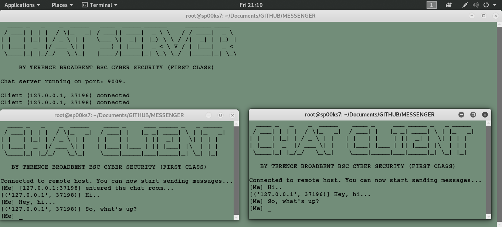

# MESSENGER
## A SIMPLE PYTHON SCRIPT FILE FOR A CHATROOM/MESSENGER SERVER AND ASSOCIATED REMOTEACCESS CLIENT(S).

Usage: python server.py 
Usage: python client.py localhost 9009

| LANGUAGE  | FILENAME  | MD5 Hash                         |
|------     |------     | -------                          |
| python    | server.py | ef7a47a8cbac98fc1116e5926421d17f |
| python    | client.py | 27b655432023d29a2493ec3cb245cecf |

- [x] Add the following encryption functions to anonymize datastream.

      https://github.com/BroadbentT/BASE64-AES
      https://github.com/BroadbentT/BASE64-BLOWFISH
      https://github.com/BroadbentT/BASE64-DNA
      
 A simple python script file for a chatroom/messenger server and associated remote access client(s).
 
### CONSOLE DISPLAY

